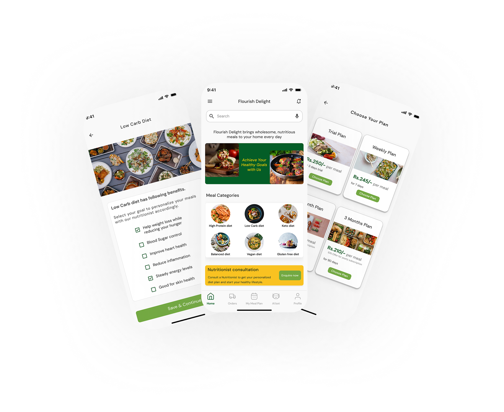

# 🥗 Flourish Delight – A Healthy Meal Delivery App

**A UI/UX Case Study focused on making healthy eating easier and more delightful through a minimal, user-friendly mobile app experience.** 

---

## 📌 Project Overview

In today's fast-paced world, maintaining a healthy lifestyle is challenging. Flourish Delight aims to bridge the gap between healthy choices and daily convenience by offering an intuitive and personalized meal delivery app.

---

## 🧠 Problem Statement

Many health-focused food delivery apps suffer from:
- Overwhelming UI
- Lack of personalization in meal and delivery preference
- Limited flexibility in meal adjustments
- Lack of live tracking information
---

## 🎯 Goal

To design a seamless, visually appealing mobile app that:
- Encourages healthy choices
- Simplifies the ordering experience
- Offers personalized meal suggestions
- Offers flexible & convenient meal plan adjustments and delivery changes
- Promotes trust through transparent nutritional info

---

## 🧪 Design Process

1. **Empathize** – User Interviews, Competitor Analysis  
2. **Define** – User Personas, Problem Statements  
3. **Ideate** – Information Architecture, User Flow
4. **Prototype** – Wireframes to High-Fidelity UI in Figma  
5. **Test** – Usability Testing & Iteration  

---

## 🧭 Key Features

- Smart meal recommendations
- Visual filters for dietary needs & Delivery Preference
- Smooth onboarding experience
- Nutritional breakdown per meal
- Flexible Meal Plan adjustments
- Clean and simple UI for a calming experience

---

## 🎨 Tools Used

- Figma (Design & Prototyping)
- Adobe Photoshop
- Miro (User flows & brainstorming)

  ---

[🔗 View Full Case Study on Behance](https://www.behance.net/gallery/213815003/Flourish-Delight-A-Healthy-Meal-Delivery-app)

---

